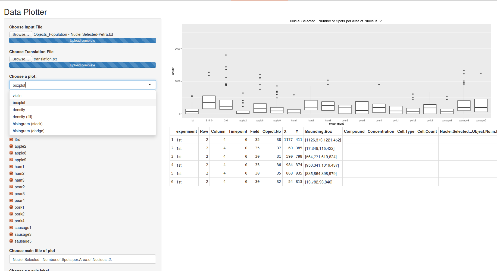

# DistancePlotter #

## Running ##

- create a folder to accomodate DistancePlotter, e.g. PlottingApp
- copy server.R and ui.R into that folder, e.g. PlottingApp
- the application can be run either via command line R or Rstudio

### command line R ###
`runApp(PlottingApp)`

### Rstudio ###
- open either server.R, ui.R or both
- hit "Run App"
- depending on your preferences you can maximise the window into browser

## Usage ##

### Data ###
The upper left corner is used to open data files.
- all input files should be saved as TAB delimited files
- the file containing the data to be plotted should contain headers
- DistancePlotter will create an "experiment ID" from the 3 columns named "Row", "Column", "Timepoint", e.g. "2_4_0"

- a translation table can be used to name experiments according to your wishes
-- the file should be TAB delimited without headers
-- first column should contain the "experiment ID", e.g. 2_4_0
-- second column should contain your desired experiment name

### Plotting ###
All fields influence the plot shown on the right hand side instantly and can be revised at any time.
- select the type of plot
-- density will draw empty areas
-- density (fill) will draw colored areas
-- histogram (stack) will stack all bars
-- histogram (dodge) will print each experiment's bar starting at x-axis

- select which column to plot
- select samples to plot

- change the title and y-axis label of the plot, whereas y-axis label will be used as x-axis label for density plots and histograms

- limiting of plotted data and scaling of the y- or x-axis may cause confusion, i.e. log10 scaling with minimal value=0

- one column can be selected to filter the plotted data, e.g. to selectively show data of nuclei containing 2 spots, ...

- Download will save the last plot as "plot.pdf"

## ToDo ##
- influence the order of experiments shown
- influence experiment color
- second factor selection should sport "=" as well
- second factor selection may also be written as free text to enter custom combination of factors
- statistics to identify significantly different distributions (Mann-Whitney-U test)

